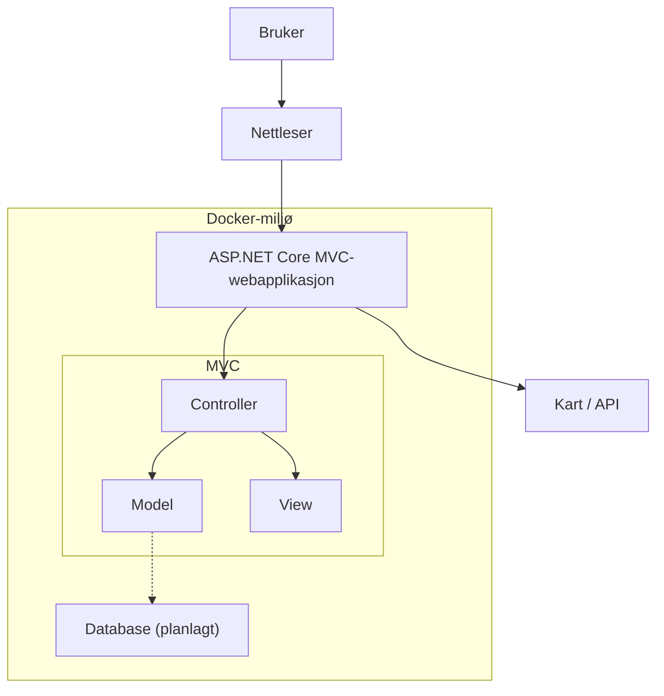

# System arkitektur

For denne webapplikasjonen har vi tatt i bruk MVC rammeverket (Model, View og Controllers). Webapplikasjonen er bygget som en monolittisk løsning, hvor kjernefunksjonaliteten er samlet i en webapplikasjon og kjører som en enhet. Dette gjør at de ulike delene av systemet er samlet i samme prosess, samtidig som webapplikasjonen kan kommunisere med og benytte eksterne tjenester ved behov (Microsoft Learn, 2023).

## Drift og Kjøring

Webapplikasjonen er en ASP.NET Core MVC-applikasjon som kjøres i en Docker-container.

### Forutsetninger

- Docker Desktop må være installert og kjøre.
- Maskinen må ha tilgang til internett første gang prosjektet bygges, fordi Docker
    henter .NET-images og NuGet-pakker.
- Nettleseren må ha internettilgang for å laste kartdata fra Leaflet/OpenStreetMap.

### Starte applikasjonen

Kjør følgende kommando fra prosjektmappen:

```bash
docker compose up --build
```

Når containerne er startet, er webapplikasjonen tilgjengelig på:

`http://localhost:8081`

Ressurser lagres midlertidig i minnet gjennom `ResourceStore` og er tapt når
webcontaineren starter på nytt.

### Stoppe applikasjonen

For å stoppe containerne:

```bash
docker compose down
```

### Feilsøking

Se status og logger med:

```bash
docker compose ps
docker compose logs web
```

Dersom port `8081` allerede er i bruk, må portmappingen i `docker-compose.yml`
endres.

Ved endringer i koden bør applikasjonen bygges på nytt.

# Test scenarioer
En essensiell del av utviklingsprosessen er å teste produktet både underveis og etterpå. Det er viktig at en både avgrenser hva en skal teste, samtidig som at det holdes relevant til hva brukerne skal gjøre i applikasjonen. Ved å lage test scenarier kan en sette spesifikke deler av applikasjonen i rampelyset og fokusere på det som fungerer eller ikke fungerer. Det er også mulig at en avslører flere problemstillinger enn en originalt hadde forestilt seg, noe som kan være enklere å fikse i de tidligere fasene enn ved slutten av produksjonen. Hvis en kun tester avsluttende kan konsekvensene bli mye større da det kan oppstå en domino-effekt der en feil leder til flere feil videre i systemet.

##	Scenario - Forventninger - Resultat - Status
| # |	Scenario | Forventet resultat | Faktisk resultat | Status |
|---|------------|--------------------|------------------|--------|
| 1	| Opp en ressurs og finn den igjen | Ressurs blir opprettet og er synlig i "My resources" | Feil med desimaltegn (komma/punktum), løst. Ingen error melding når en har gitt ugyldig input på kontakt informasjon - uløst | Delvis løst |
| 2	| Sjekk alle koblinger | Alle lenker skal føre til riktig side eller gi en error beskjed | "Privacy" går til feil sted, mangler egen side eller error. "Resource provider" aka bruker er ikke klikkbar | Planlegger å fikse neste sprint |
| 3	| Kart oppdaterer skjema | Skjema blir oppdatert når en klikker på kartet | Fungerer slik det skal | Ok |
| 4	| GET og POST-håndtering | POST-håndtering når skjema sendes inn, og GET-håndtering på redirect til "My resources" | Virker som det skal | Ok |
| 5	| Responsivt | Webapplikasjon tilpasser seg andre skjermer - som mobil og nettbrett - og ingenting er forsvunnet ut av skjermen | Bunn-meny forsvinner på mobil når en havner på "My resources" og tabellen går ut av skjermen mens top og bottom header stopper tidligere. Resten, inkludert nettbrett fungerer | Delvis løst |


# MVC rammeverket og hvordan det henger sammen

MVC rammeverket bestå+r av Models, Views og Controllers, hvor hver del har sitt eget ansvarsområde. Controller fungerer som et bindeledd mellom brukeren og webapplikasjonen. Den mottar forespørsler fra nettleseren, behandler forespørselen og bestemmer hva som skal returneres tilbake til brukeren. Controlleren kan hente eller lagre data gjennom webapplikasjonens datakomponenter før den returnerer et View.
Et view er det brukeren ser og samhandler med i nettleseren. Det består av HTML markup og dynamisk innhold som sendes til nettleseren. En controller kan returnere en view som viser informasjon til brukeren.
Til sist har vi Model som representerer dataen som brukes i webapplikasjonen. Den kan blant annet inneholde egenskaper for dataene og regler for validering. I webapplikasjonen brukes modeller og viewmodeller til å overføre og håndtere data mellom ulike deler av systemet. ResourceViewModel brukes av registreringsskjemaet, mens ResourceEntry representerer ressursen som lagres i ResourceStore.
Sammen gjør disse komponentene at webapplikasjonen får en tydelig struktur, hvor presentasjon, håndtering av forespørsler og data er delt opp i separate deler (Walther, 2022).

## Hvordan data flyter gjennom systemet (eksempel fra koden)
Data flyter gjennom systemet ved at brukeren sender en forespørsel fra nettleseren, dette blir mottatt av Controlleren som behandler den og eventuelt sender eller henter data fra Models eller andre komponenter. Controlleren returnerer deretter en view som presenterer resultatet for brukeren.
Ved innsending av et skjema vil dataen sendes til serveren gjennom en POST forespørsel. Controlleren mottar dataene, behandler og validerer dem før resultatet kan vises til brukeren gjennom et nytt view. Når brukeren fyller ut registreringsskjemaet og trykker på «Register resource», sendes dataene til HomeController gjennom en POST-forespørsel. Controlleren mottar dataene gjennom RegisterResource-metoden som et ResourceViewModel-objekt. ResourceViewModel inneholder valideringsreglene for dataene som brukeren skriver inn. Etter at dataene er validert, konverterer HomeController ResourceViewModel til et ResourceEntry-objekt, som lagres i ResourceStore gjennom ResourceStore.Add(entry). Deretter videresendes brukeren til Index-handlingen i ResourcesController, som viser listen over registrerte ressurser i Views/Resources/Index.cshtml.

## Hvordan bruker, webapplikasjon og eventuelle andre komponenter henger sammen
Systemet består av en bruker som kommuniserer med webapplikasjonen gjennom en nettleser. Webapplikasjonen er utviklet med ASP.NET Core og MVC og håndterer forespørsler, data og visning. Webapplikasjonen har også mulighet til å kommunisere med andre komponenter, som karttjenesten, for å hente og lagre nødvendig informasjon. I den nåværende versjonen lagres ressursdata midlertidig gjennom ResourceStore i minnet.
Webapplikasjonen kjøres i en Docker-container. Docker brukes til å pakke webapplikasjonen og dens avhengigheter inn i et isolert miljø, dette gjør at webapplikasjonen kan kjøres på samme måte på ulike maskiner og miljøer (dockerdocs, u.d.). I prosjektet bruker vi Docker Compose til å starte og administrere webapplikasjonen lokalt. ASP.NET Core-webapplikasjonen bygges ved hjelp av en Dockerfile.

Slik henger komponentene sammen illustrert med et diagram:
### Systemarkitektur

Slik henger komponentene sammen:



## Responsivt design

Vi har tilpasset webapplikasjonen slik at den fungerer på både store og små skjermer. På større skjermer vises ressursregistreringen i et sidepanel ved siden av kartet. På mindre skjermer får kartet mest mulig plass, mens navigasjonen flyttes til bunnen av skjermen og ressursregistreringen åpnes som et panel over kartet.

Det responsive oppsettet er laget med CSS media queries og fleksible høyder og bredder. Når sidepanelet åpnes eller lukkes på mobil, beregnes kartets størrelse på nytt slik at kartet fortsatt vises riktig. Vi har også beholdt koblingen mellom kartet og ressursregistreringen, slik at et valgt punkt i kartet fyller inn breddegrad og lengdegrad i skjemaet. På denne måten kan brukeren registrere ressurser uavhengig av hvilken skjermstørrelse som brukes (MDN, u.d.).

Navigasjonen bruker Bootstrap Icons for å gjøre knappene og sidene lettere å kjenne igjen.

# KI bruk i prosjektet
I prosjektet har vi brukt KI som et hjelpemiddel gjennom ulike deler av utviklingsprosessen. Verktøyene vi har tatt i bruk er blant annet ChatGPT, Copilot og andre ulike KI modeller. Disse har hovedsakelig blitt brukt til å forklare tekniske konsepter innenfor programmering, forstå feilmeldinger, strukturere tekster og videreutvikle ideer til systemets funksjonalitet. Vi har selv vurdert, tilpasset og testet forslagene fra KI før implementasjon. KI har dermed blitt brukt som et støtteverktøy for læring, ideutvikling og problemløsning.
### Noen prompts vi har brukt aktivt gjennom innleveringen er:

•	Kan du hjelpe oss med å forstå denne feilmeldingen?

•	Kan du forklare denne kodeblokken?

•	Hva er MVC komponenter?

•	Hvorfor vil ikke webapplikasjonen kjøre?

•   Gi meg tilbakemelding på besvarelse ifht. oppgavetekst


# Bibliografi

dockerdocs. (u.d.). What is Docker? Hentet fra https://docs.docker.com/get-started/docker-overview/

Microsoft Learn. (2023, Juli 3). Common web application architectures . Hentet fra https://learn.microsoft.com/en-us/dotnet/architecture/modern-web-apps-azure/common-web-application-architectures

Walther, S. (2022, November 7). Understanding Models, Views, and Controllers (C#) . Hentet fra https://learn.microsoft.com/en-us/aspnet/mvc/overview/older-versions-1/overview/understanding-models-views-and-controllers-cs

MDN. (u.d.). Responsive web design. Hentet fra https://developer.mozilla.org/en-US/docs/Learn_web_development/Core/CSS_layout/Responsive_Design

I denne oppgaven brukte jeg ChatGPT-5.6 Luna til å identifisere og rette opp grammatiske feil, forbedre språkstrukturen, finne synonymer, forkorte teksten og hjelp med generering av diagrammet i GitHub. Jeg brukte ikke ChatGPT-5.6 Luna til å skrive hele avsnitt, men heller til å forbedre min egen tekst, der jeg korrekturleste og kvalitetssikret teksten. Jeg har brukt ChatGPT i tråd med UiAs retningslinjer for bruk av kunstig intelligens.
